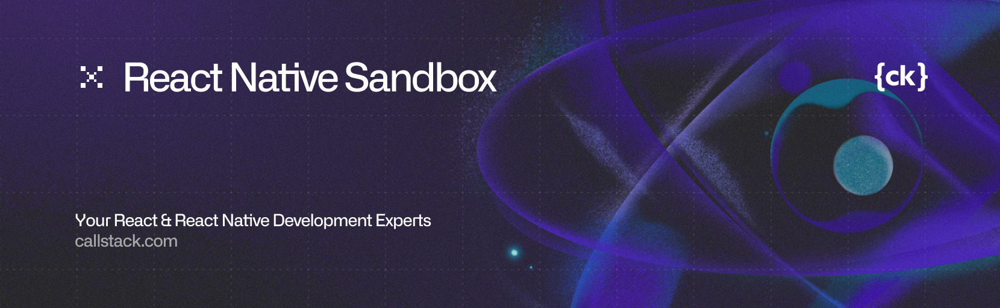

<a href="https://www.callstack.com/open-source?utm_campaign=generic&utm_source=github&utm_medium=referral&utm_content=react-native-legal" align="center">
  <picture>
    
  </picture>
</a>

<div align="center">

[](https://github.com/callstackincubator/react-native-sandbox/blob/main/LICENSE)
[](https://www.npmjs.org/package/@callstack/react-native-sandbox)
[](https://www.npmjs.org/package/@callstack/react-native-sandbox)
[](https://www.npmjs.org/package/@callstack/react-native-sandbox)
[](https://github.com/callstackincubator/react-native-sandbox/actions/workflows/check.yml)
[](https://img.shields.io/badge/platform-iOS-blue.svg)
[](https://img.shields.io/badge/platform-android-green.svg)
[](https://reactnative.dev/)

</div>

Execute React Native micro-apps with confidence using [`react-native-sandbox`](./packages/react-native-sandbox/README.md)

```bash
npm install @callstack/react-native-sandbox
```

- [💡 Project Overview](#-project-overview)
- [📝 API Example](#-api-example)
- [📚 API Reference](#-api-reference)
- [🎨 Roadmap](#-roadmap)
- [🔒 Security Considerations](#-security-considerations)
  - [TurboModules](#turbomodules)
  - [Performance](#performance)
  - [File System & Storage](#file-system--storage)
  - [Platform-Specific](#platform-specific-considerations)

`react-native-sandbox` is a library for running multiple, isolated React Native instances within a single application. This allows you to embed third-party or feature-specific "micro-apps" in a sandboxed environment, preventing uncontrolled interference with the main app by providing a clear API for communication (`postMessage`/`onMessage`).

## 💡 Project Overview

This project was born from the need to safely run third-party code within a react-native application. The core requirements are:

- **Isolation:** Run external code in a secure, sandboxed environment.
- **Safety:** Prevent direct access to the host application's code and data.
- **Communication:** Provide a safe and explicit API for communication between the host and the sandboxed instances.

> Note that `postMessage` only supports serializable data (similar to [`Window.postMessage`](https://developer.mozilla.org/en-US/docs/Web/API/Window/postMessage#message) in web browsers), meaning no functions, native state, or non-serializable objects can be passed.

`react-native-sandbox` provides the API to create these sandboxed React Native instances with a simple component-based API, requiring no native code to be written by the consumer.

This project is structured as a monorepo.

- [`packages/react-native-sandbox`](./packages/react-native-sandbox/): the core library
- [`apps/*`](./apps/): examples

To run the examples:

1. Install dependencies:

    ```sh
    bun install
    cd apps/<specific-example>
    bun install
    ```

1. Run the example application:

    ```sh
    bun ios
    ```


## 📝 API Example

Here is a brief overview of how to use the library.

### Host Application (`HostApp`)

```tsx
import React, { useRef } from 'react';
import { View, Button } from 'react-native';
import SandboxReactNativeView, { SandboxReactNativeViewRef } from 'react-native-sandbox';

function HostApp() {
  const sandboxRef = useRef<SandboxReactNativeViewRef>(null);

  const handleMessage = (message) => console.log("Message received from sandbox:", message);
  const handleError = (error) => console.error("Error in sandbox:", error);
  const sendMessageToSandbox = () => sandboxRef.current?.postMessage({ data: "Hello from the host!" });

  return (
    <View>
      <Button onPress={sendMessageToSandbox} title="Send to Sandbox" />
      <SandboxReactNativeView ref={sandboxRef}
        jsBundleSource={"sandbox"} // The JS bundle: file name or URL
        componentName={"SandboxApp"} // Name of component registered in bundle provided with jsBundleSource
        onMessage={handleMessage}
        onError={handleError}
      />
    </View>
  );
}
```

### Sandboxed Application (`SandboxApp`)

```tsx
import React, { useState, useEffect, useCallback } from 'react';
import { View, Button, Text } from 'react-native';

// No import required, API available through global
declare global {
  var postMessage: (message: object) => void;
  var setOnMessage: (handler: (payload: object) => void) => void;
}

function SandboxApp() {
  const [data, setData] = useState<string | undefined>();

  // Listen for messages from the host
  const onMessage = useCallback((payload: unknown) => {
    setData(JSON.stringify(payload));
  }, []);

  useEffect(() => {
    globalThis.setOnMessage(onMessage);
  }, [onMessage]);

  // Send a message back to the host
  const postMessageToHost = () => {
    // `postMessage` is also injected into the global scope
    globalThis.postMessage({ data: 'Hello from the Sandbox!' });
  };

  return (
    <View>
      <Button onPress={postMessageToHost} title="Send Data to Host" />
      <Text>Received: {data}</Text>
    </View>
  );
}

AppRegistry.registerComponent("SandboxApp", () => App);
```

Full examples:

- [`apps/demo`](./apps/demo/README.md): Security demo.
- [`apps/side-by-side`](./apps/side-by-side/README.md): An example application with two sandbox instances.
- [`apps/recursive`](./apps/recursive/README.md): An example application with few nested sandbox instances.
- [`apps/p2p-chat`](./apps/p2p-counter/README.md): Direct sandbox-to-sandbox chat demo.
- [`apps/p2p-counter`](./apps/p2p-counter/README.md): Direct sandbox-to-sandbox communication demo.
- [`apps/fs-experiment`](./apps/fs-experiment/README.md): File system & storage isolation with TurboModule substitutions.

## 📚 API Reference

For comprehensive API documentation, installation instructions, and advanced usage patterns, see the [package documentation](https://github.com/callstackincubator/react-native-sandbox/blob/main/packages/react-native-sandbox/README.md).

## 🎨 Roadmap

We're actively working on expanding the capabilities of `react-native-sandbox`. Here's what's planned:

- [x] **Android Support** - Full cross-platform compatibility
- [x] **Inter-Sandbox Communication** - [Secure direct communication between sandbox instances](packages/react-native-sandbox/README.md#p2p-communication-between-sandboxes)
- [ ] **[RE.Pack](https://github.com/callstack/repack) Integration** - Advanced bundling and module federation
  - Hot-reloading for sandbox instances in development
  - Dynamic bundle fetching from remote sources
  - Optimized bundle splitting for sandbox applications
  - Module federation capabilities
- [ ] **Enhanced Security Features** - Advanced security mechanisms
  - Custom permission system for sandbox instances
  - Resource usage limits and monitoring
  - Sandbox capability restrictions
  - Unresponsiveness detection 
- [x] **TurboModule Substitutions** - Replace native module implementations per sandbox
  - Configurable via `turboModuleSubstitutions` prop (JS/TS only)
  - Sandbox-aware modules receive origin context for per-instance scoping
  - Supports both TurboModules (new arch) and legacy bridge modules
- [x] **Storage & File System Isolation** - Secure data partitioning
  - Per-sandbox AsyncStorage isolation via scoped storage directories
  - Sandboxed file system access (react-native-fs, react-native-file-access) with path jailing
  - All directory constants overridden to sandbox-scoped paths
  - Network/system operations blocked in sandboxed FS modules
- [ ] **Developer Tools** - Enhanced debugging and development experience

Contributions and feedback on these roadmap items are welcome! Please check our [issues](https://github.com/callstackincubator/react-native-sandbox/issues) for detailed discussions on each feature.

## 🔒 Security Considerations

### TurboModules

A primary security concern when running multiple React Native instances is the potential for state sharing through native modules, especially **TurboModules**.

- **Static State:** If a TurboModule is implemented with static fields or as a singleton in native code, this single instance will be shared across all React Native instances (the host and all sandboxes).
- **Data Leakage:** One sandbox could use a shared TurboModule to store data, which could then be read by another sandbox or the host. This breaks the isolation model.
- **Unintended Side-Effects:** A sandbox could call a method on a shared module that changes its state, affecting the behavior of the host or other sandboxes in unpredictable ways.

To address this, `react-native-sandbox` provides two mechanisms:

- **TurboModule Allowlisting** — Use the `allowedTurboModules` prop to control which native modules the sandbox can access. Only modules in this list are resolved; all others return a stub that rejects with a clear error.

- **TurboModule Substitutions** — Use the `turboModuleSubstitutions` prop to transparently replace a module with a sandbox-aware alternative. For example, when sandbox JS requests `RNCAsyncStorage`, the host can resolve different  implementation like `SandboxedAsyncStorage` instead — an implementation that scopes storage to the sandbox's origin. Substituted modules that conform to `RCTSandboxAwareModule` (ObjC) or `ISandboxAwareModule` (C++) receive the sandbox context (origin, requested name, resolved name) after instantiation.

```tsx
<SandboxReactNativeView
  allowedTurboModules={['RNFSManager', 'FileAccess', 'RNCAsyncStorage']}
  turboModuleSubstitutions={{
    RNFSManager: 'SandboxedRNFSManager',
    FileAccess: 'SandboxedFileAccess',
    RNCAsyncStorage: 'SandboxedAsyncStorage',
  }}
/>
```

**Default Allowlist:** A baseline set of essential React Native modules is allowed by default (e.g., `EventDispatcher`, `AppState`, `Appearance`, `Networking`, `DeviceInfo`, `KeyboardObserver`, and others required for basic rendering and dev tooling). See the [full list in source](https://github.com/callstackincubator/react-native-sandbox/blob/main/packages/react-native-sandbox/src/index.tsx). Third-party modules and storage/FS modules are *not* included — they must be explicitly added via `allowedTurboModules` or provided through `turboModuleSubstitutions`.

### Performance

- **Resource Exhaustion (Denial of Service):** A sandboxed instance could intentionally or unintentionally consume excessive CPU or memory, potentially leading to a denial-of-service attack that slows down or crashes the entire application. The host should be prepared to monitor and terminate misbehaving instances.

### File System & Storage

- **Persistent Storage Conflicts:** Standard APIs like `AsyncStorage` are not instance-aware by default, potentially allowing a sandbox to read or overwrite data stored by the host or other sandboxes. Use `turboModuleSubstitutions` to replace these modules with sandbox-aware implementations that scope data per origin.
- **File System Path Jailing:** Sandboxed file system modules (`SandboxedRNFSManager`, `SandboxedFileAccess`) override directory constants and validate all path arguments, ensuring file operations are confined to a per-origin sandbox directory. Paths outside the sandbox root are rejected with `EPERM`.
- **Network Operations Blocked:** Sandboxed FS modules block download/upload/fetch operations to prevent data exfiltration.

See the [`apps/fs-experiment`](./apps/fs-experiment/) example for a working demonstration.

### Platform-Specific Considerations

- **iOS `NSNotificationCenter`:** The underlying React Native framework uses the default `NSNotificationCenter` for internal communication. Because the same framework instance is shared between the host and sandboxes, it is theoretically possible for an event in one JS instance to trigger a notification that affects another. This could lead to unintended state changes or interference. While not observed during development, this remains a potential risk.
