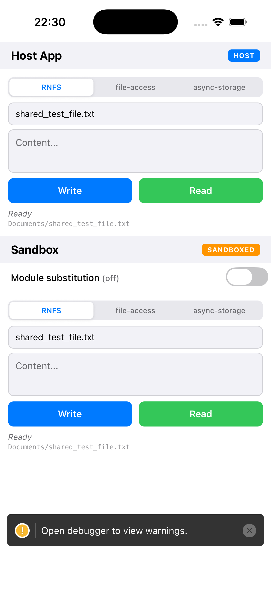

# File System & Storage Isolation

This example demonstrates **TurboModule substitutions** — transparently replacing native module implementations inside a sandbox with scoped, per-origin alternatives. The app uses a split-screen layout where the host and sandbox run the same UI, but the sandbox can swap `react-native-fs`, `react-native-file-access`, and `@react-native-async-storage/async-storage` for sandboxed implementations that jail file paths and scope storage per origin.

## Screenshot

  

