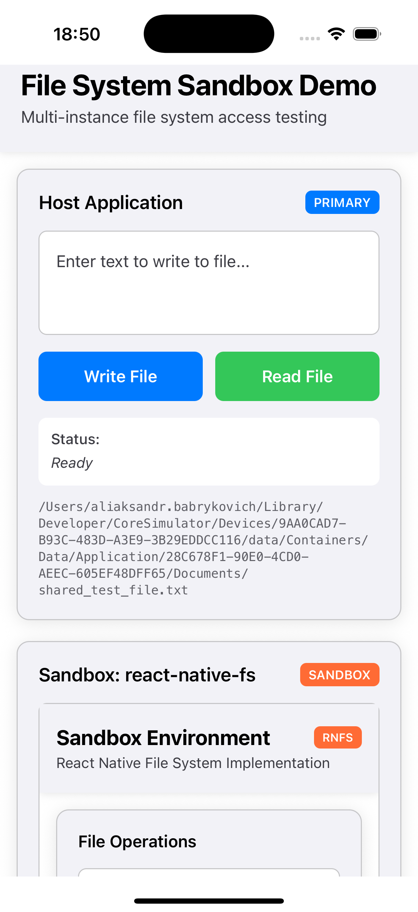

# File System Access Example

This example demonstrates how to enable file system access in multi-instance environments by whitelisting the necessary native modules. The application shows how sandboxed React Native instances can be configured to access file system APIs when explicitly allowed.

The experiment uses two popular React Native file system libraries:
- **react-native-fs** - Traditional file system operations
- **react-native-file-access** - Alternative file system API

The host application creates multiple sandbox instances and demonstrates how to whitelist these modules to enable controlled file system access across instances while maintaining security boundaries.

## Screenshot

  

