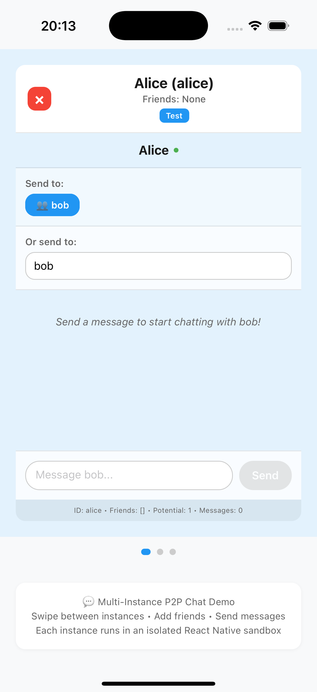

# P2P Chat Carousel

This example demonstrates advanced peer-to-peer communication between multiple isolated React Native sandboxes using `react-native-sandbox`. It features a carousel interface where users can dynamically add/remove chat instances, with each sandbox operating independently while communicating directly with others through a friendship system and real-time messaging.

The demo showcases dynamic instance management, multi-target communication, friend request handling, and a sophisticated message routing system - all while maintaining complete isolation between sandbox environments. Users can swipe between different chat instances (Alice, Bob, Charlie, Diana, Eve, Frank), send friend requests, accept/reject friendships, and engage in real-time conversations.

## Screenshot

  

