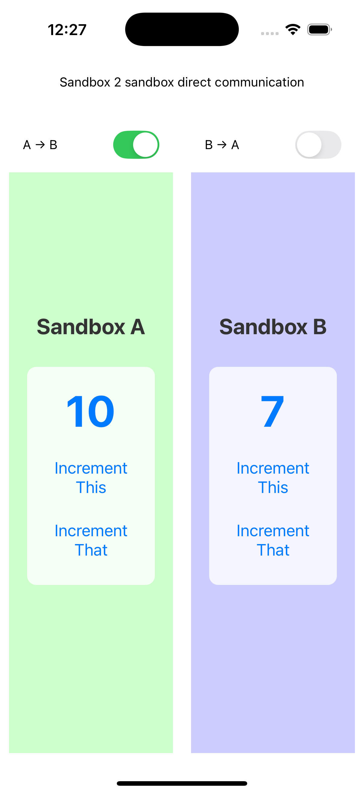
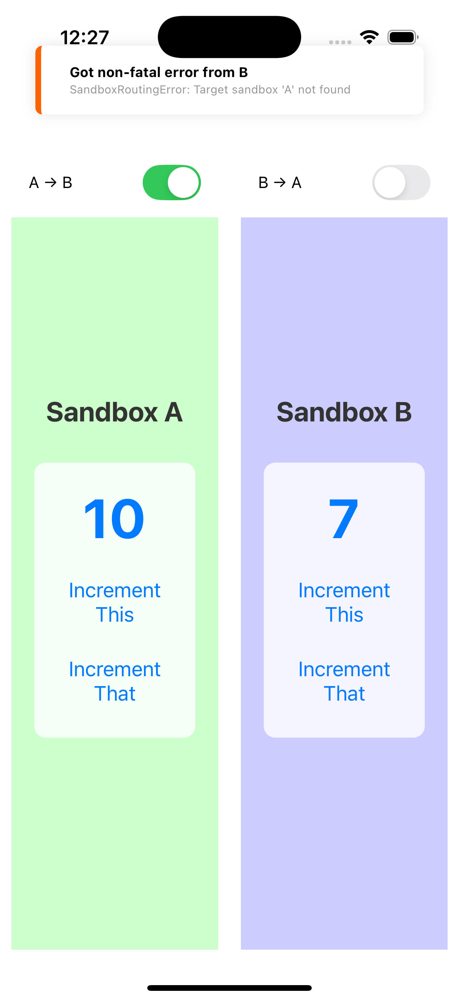

# P2P Counter Demo

This example demonstrates direct peer-to-peer communication between two isolated React Native sandboxes using `react-native-sandbox`. It features two side-by-side sandbox instances (A and B), each containing a counter app with "This" and "That" counters. The demo showcases controlled communication where sandboxes can send increment events directly to each other based on configurable origin permissions.

Users can toggle communication switches to enable/disable message flow between sandboxes, demonstrating the library's ability to provide isolated environments while allowing controlled inter-sandbox communication. The "Increment This" button works locally, while "Increment That" sends messages directly to the other sandbox's counter.

## Screenshot

  
  

