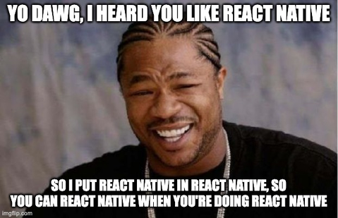
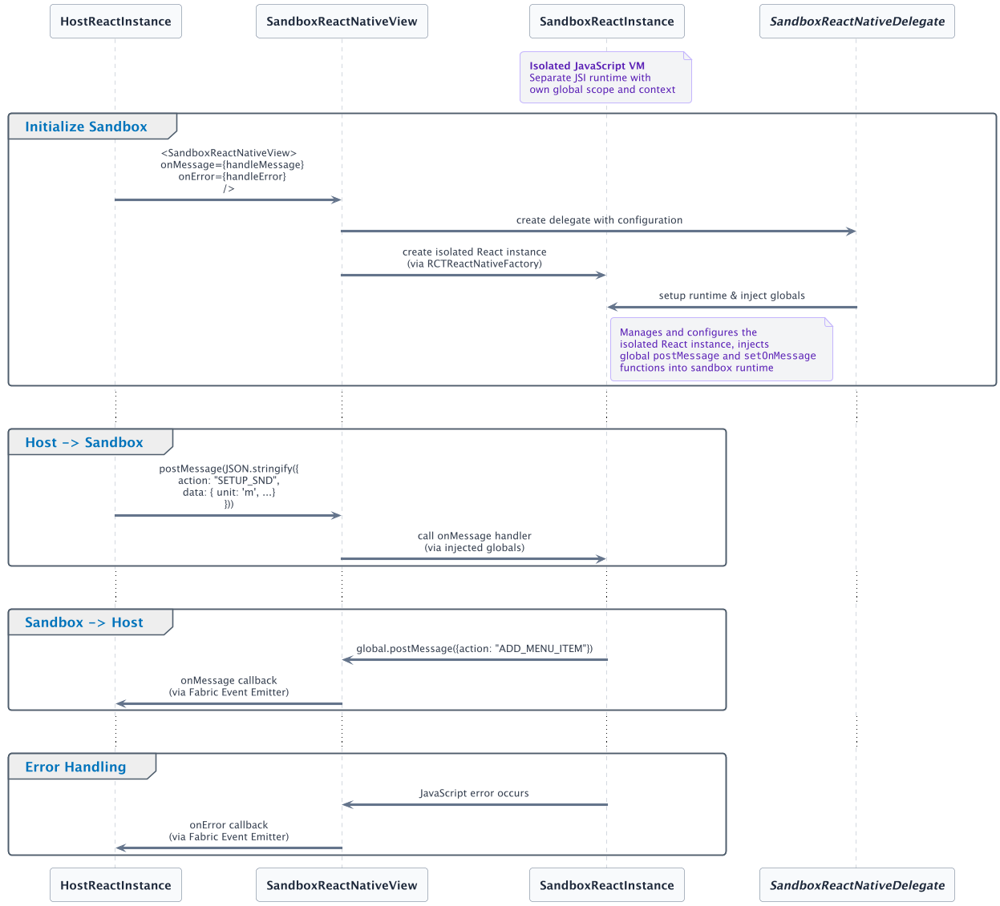
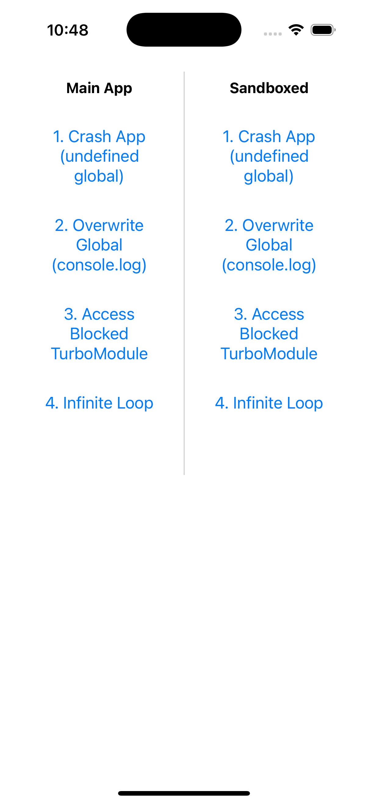

# React Native Inception: When One App Just Isn't Enough

## Intro

Six years ago, a brave soul ventured into the depths of r/reactjs and asked the forbidden question: ["How to embed a React Native app inside another React Native app?"](https://www.reddit.com/r/reactjs/comments/d9flm6/how_to_embed_a_react_native_app_inside_another/) 

The response was... well, let's just say the React community wasn't exactly bursting with enthusiasm. With a whopping 3 upvotes and few comments that can be summarized as: "Why would you even want to do that?"

And that was it. Case closed. The post quietly disappeared into the digital abyss where brave but unpopular ideas go to die... or not!

<div align="center">
  
</div>
<br/>

Well, sometimes the "easier way around" is actually the boring way around, and where's the engineering joy in doing things the sensible way? I'm here to tell you that there **actually is a place for this idea**, and the `react-native-sandbox` package is here to prove it.

What if I told you that you *can* actually run React Native inside React Native? Not with WebViews (ew), not with some hacky iframe solution, but with actual, honest-to-goodness React Native components rendering other React Native components in isolated JavaScript contexts?

Yes, this is the story of how we took the concept of "nested apps" and made it so meta that even Christopher Nolan would be envious.

<div align="center">
  
</div>
<br/>

So we put React Native in your React Native so you can render components while you render components! It's like when someone first figured out you could run a virtual machine inside a virtual machine.

## But Actually, This Makes Sense

Okay, jokes aside—let's talk about why you might actually want to run React Native inside React Native (and why it's not just a meme experiment gone rogue).

Picture this: you’re building a platform where different features, plugins, or even entire mini-apps need to run in isolation, possibly developed by different teams, delivered on different schedules, and with different dependencies. This is where `react-native-sandbox` shines:

- **True Isolation**: Each plugin or tenant runs in its own React Native instance, with its own JavaScript context and native module access. No more global namespace collisions or dependency hell.
- **Independent Delivery**: Teams can ship, update, or roll back their features independently, without waiting for a monolithic app release cycle.
- **Team Autonomy**: Different teams (or even external partners) can work on their own plugins, using their own toolchains, dependencies, and release cadences.
- **Crash Containment**: If one plugin crashes, it doesn’t take down the whole app—just that isolated instance.
- **Security & Permissions**: You can restrict which native modules or APIs each plugin can access, reducing the blast radius of bugs or vulnerabilities.
- **A/B Testing & Experiments**: Easily swap in and out different plugin versions for different users, without risking the stability of the main app.
- **Legacy & Migration**: Run old and new code side by side, or gradually migrate legacy features to new architectures without a big-bang rewrite.

What started as a joke is actually a powerful tool for building more modular, flexible, and future-proof React Native apps. Sometimes, the wild ideas are the ones that move the platform forward.

## What is `react-native-sandbox`

`react-native-sandbox` is a React Native component and native module that allows you to run multiple, fully isolated React Native instances side by side within a single app. Each instance runs its own JavaScript bundle, maintains its own state, and can be configured with a specific set of allowed native modules (TurboModules).

Key features:
- **Isolation**: Each sandboxed instance has its own JavaScript runtime and native bridge, preventing interference between plugins or tenants.
- **Configurable Permissions**: You can specify which native modules are accessible to each instance, improving security and stability.
- **Communication through a safe API**: Instances can communicate with the host app via a controlled, message-passing API that enforces boundaries and prevents unsafe interactions.
- **Flexible Integration**: Use cases include plugin systems, micro-frontends, multi-tenant apps, and gradual migration of legacy code.

In short, react-native-sandbox provides a robust foundation for building modular, extensible, and independently upgradable features within a single React Native application.

On API level you will deal with `SandboxReactNativeView` component in your JSX:

```jsx
<SandboxReactNativeView
  style={styles.sandboxContainer}
  jsBundleSource={'my-plugin'}
  componentName={'PluginComponent'}
  onMessage={(message) => {
    console.log(`Message: ${message} received through safe API`)
  }}
  onError={(error) => {
    console.warn(`Sandbox error: ${error.message} - handle gracefully without crashing host`)
    return false // Error handled
  }}
/>
```

The `jsBundleSource` property is flexible and supports multiple ways to load your sandbox code:
- **Bundle name**: `'my-plugin'` - references a named bundle
- **Local files**: bundled into the app during build time
- **Remote URL**: `'https://example.com/plugin.bundle.js'` - dynamically loaded bundles

You can also control security and permissions using `allowedTurboModules` to specify which native modules the sandbox can access i.e. whitelist approach

Communication works between the host app and sandbox instances using Fabric Native Components:

<div align="center">
  
</div>

## It's show time!

Our demo app is delightfully destructive—in the name of science, of course.

<div align="center" style="width: 240px; height: 300px; margin: 0 auto;">
  
</div>
<br/>
On the left, you'll see the "Main App" column running a component directly in the host application. On the right, the "Sandboxed" column runs the exact same component inside a `SandboxReactNativeView`. While they visually look identical, the sandboxed version is running in complete isolation.

```jsx
<View>
  <View>
    <Text>Main App</Text>
    <CrashIfYouCanDemo />
  </View>
  <View>
    <Text>Sandboxed</Text>
    <SandboxReactNativeView
      style={styles.sandboxView}
      jsBundleSource={'sandbox'}
      componentName={'CrashIfYouCanDemo'}
      onError={error => {
        Toast.show({...})
        return false
      }}
    />
  </View>
</View>
```

`CrashIfYouCanDemo` component provides collection of buttons that would make any QA engineer reach for their coffee:

- **Crash App**: Calls undefined global methods that would normally bring down the entire application
- **Overwrite Global**: Hijacks `console.log` and other global variables, potentially breaking logging throughout the app
- **Access Blocked TurboModule**: Attempts to use native modules that have been restricted for the sandbox
- **Infinite Loop**: Because sometimes you just want to watch the world burn (or at least the JavaScript thread)

The magic happens when you start pressing buttons. Actions triggered in the main app can crash, freeze, or destabilize your entire application—exactly what you'd expect. But when you trigger the same destructive actions in the sandboxed environment? The sandbox contains the chaos, logs the errors gracefully, and your main app keeps running like nothing happened.

## FAQ (First-time Asked Questions)

**Q: Is this safe for production?**
A: Yes, with proper configuration and testing. Each instance is isolated, and you control which native modules are exposed (more information in [Security Considerations](https://github.com/callstackincubator/react-native-sandbox?tab=readme-ov-file#-security-considerations) section of README)

**Q: What about performance?**
A: Each sandboxed instance has its own JS runtime, so there is some overhead. For most plugin/multi-tenant use cases, the tradeoff is worth it for the isolation and flexibility.

**Q: Can sandboxes communicate with each other?**
A: Not directly. All communication goes through the host app via a safe, message-passing API. But we consider it as possible feature for future

**Q: What platforms are supported?**
A: iOS at the moment

**Q: Can I restrict what a plugin can do?**
A: Yes. You can whitelist which native modules (TurboModules) are available to each sandbox, limiting access to sensitive APIs.

## What is the next

We have a lot of ideas of upcoming features in our [Roadmap](https://github.com/callstackincubator/react-native-sandbox?tab=readme-ov-file#-roadmap) is something is missing don't hesitate to [let us know](https://github.com/callstackincubator/react-native-sandbox/issues/new)

<div align="center">
  <a href="https://github.com/callstackincubator/react-native-sandbox/blob/main/apps/recursive/README.md">
    
  </a>
</div>

