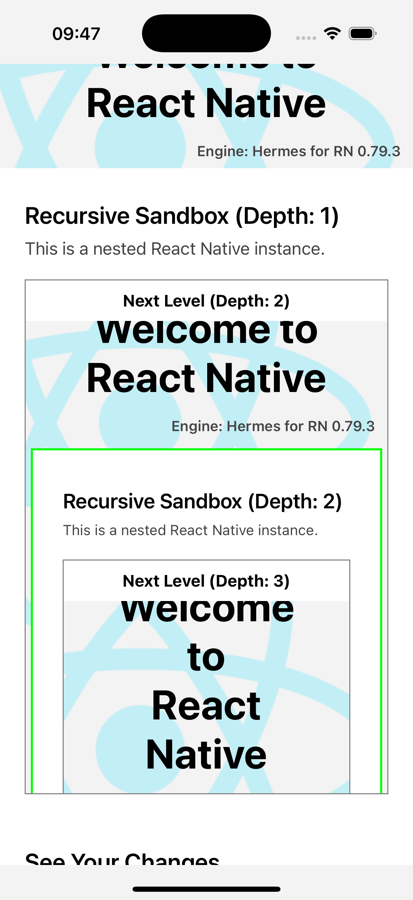

# Recursive Example

This example demonstrates the capability of `react-native-multinstance` to create and manage nested React Native instances. The application recursively renders `SandboxReactNativeView` components, each encapsulating another instance of the same application, up to a predefined maximum depth.

  

