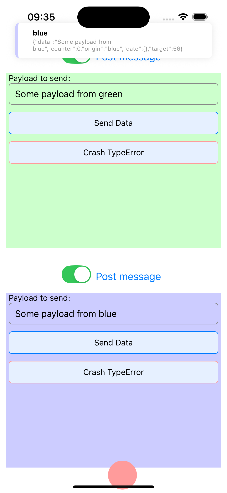
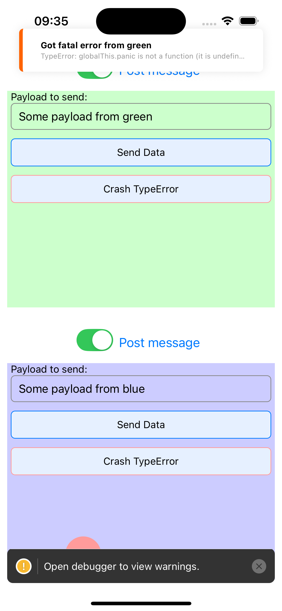

# Side-by-Side Example

This example showcases the ability of `react-native-multinstance` to run multiple, independent React Native instances  within a single application. It features two distinct sandbox instances displayed side-by-side, each operating in its own isolated environment. This setup effectively demonstrates the library's core capability of preventing interference between different embedded applications while allowing controlled communication.

The example also includes a bouncing ball animation in the host app, this specifically demonstrates that `react-native-multinstance` does not interfere with JavaScript contexts created by other libraries, such as [`react-native-worklets`](https://github.com/margelo/react-native-worklets-core) used by `react-native-reanimated`. This is ideal for scenarios requiring modular, isolated components within a larger application.

## Screenshot

  
  

